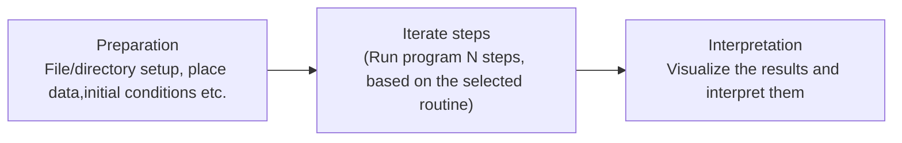

:::::::::::::::::::::::::::::::::::::: questions 

- How do we choose a characteristic benchmark of codebase?

::::::::::::::::::::::::::::::::::::::::::::::::

::::::::::::::::::::::::::::::::::::: objectives

- Prepare the benchmark case
- Define the benchmark characteristics

::::::::::::::::::::::::::::::::::::::::::::::::

In this subsection, we will look at how to prepare a benchmark case to see the performance of the code. It usally calls "pre-assessment" (e.g. defining charctesistics of benchmark, preparing the compiler setup etc). As all domains could differentiate from one to other in terms of algoritmic complexity and behaviour etc, we will treat the code like a black-box and prepare the setup based on some rules. This rules can be checked via a checklist to identify basic informations from code. This informations will help the person that will run the benchmark between the code owner. Because it is not always the case we benchmark our own codes. It generally carries out via external people who might be unfamillar to our domain. Without previous knowledge of code, the checklist will help us to understand underlying characteristics of code and its behaviour on targeting machine. 

## Checklist

::::::::::::::::::::::::::::::::::::::::::::::callout
Before starting benchmark the code and analysis it, it is expected to fill the knowledge gap between owner of the code and benchmark analyst. Below points reflects initial checks for code:
 
 1. An archive that contains all files,
 2. Relying on a static files (making sure that the files for benchmarking is not going to be changed during the analysis),
 3. Include the documentation of benchmark (e.g. how to build and run the code)
 4. Reduce size of benchmark, however not too small, it should be representative for the case study.
::::::::::::::::::::::::::::::::::::::::::::::::::::

:::::::::::::::::::::::::::::::::::::::::::::::::::::::::::::::::::: instructor

This part of section related how to use Cosma Azimuth system.
::::::::::::::::::::::::::::::::::::::::::::::::::::::::::::::::::::::::::::::::

::::::::::::::::::::::::::::::::::::: challenge 

## Challenge 1: Is this a good benchmark case?

A main routine of a large scientific code has planned into a benchmark. It only tests that main routine,
and it can only run a small problem size.

1. According to the checklist above, is this a good benchmark?
2. What's the main thing missing?

:::::::::::::::::::::::: solution

### Solution

**1.** No, it's missing two things the checklist asks for.

**2.** It only tests a main routine,however it worth to check how other routines are behaving in the code. It also can be benchmark with different problem sizes. A good
benchmark should cover multiple routines and be configurable to
run at different problem sizes.

::::::::::::::::::::::::::::::::
::::::::::::::::::::::::::::::::::::::::::::::::

## Designing a Benchmark

All benchmarks do not measure same characteristics of the code. Therefore, we need to design our benchmarks depends on what metrics and characteristics we want to compare and that improve our code accordingly. In this case, you may have no idea where to start designing a benchmark for your code. It is also common people uses benchmarking tools with significant overhead while not having a representative small case of setup. Avoiding all time wasting we recommend you to follow below three stages:

::::::::::::::::::::::::::::::::::::: callout

We can not skip correctness even if got successfully run the benchmark. It is expected from a good benchmark performs well in representative benchmark but also needs to be checked via unit tests for their codes. Therefore before collecting the results, it needs to beconfirmed the run computationly correct and accurate.

::::::::::::::::::::::::::::::::::::::::::::::::

## Setting Environment

To run effectively a good benchmark case, you have to well prepare your working enviroment including compiler setup align with hardware details etc. It could be challenging if you are using several machines and different types of compilers for your benchmark case. Therefore, in this lesson we aim to provide a guidelenss how to structure your directories including compiler setup. So that you will be able to pick your results without worrying about environment changes. 
:::::::::::::::::::::::::::::::::::: keypoints 

- Use `.md` files for episodes when you want static content
- Use `.Rmd` files for episodes when you need to generate output
- Run `sandpaper::check_lesson()` to identify any issues with your lesson
- Run `sandpaper::build_lesson()` to preview your lesson locally

::::::::::::::::::::::::::::::::::::::::::::::::

[r-markdown]: https://rmarkdown.rstudio.com/
